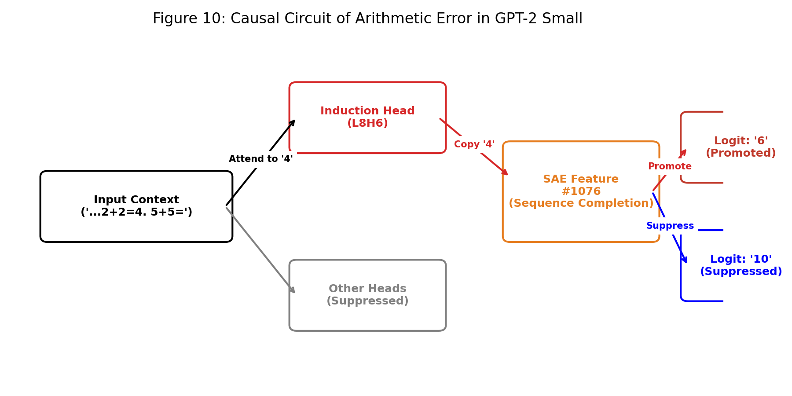
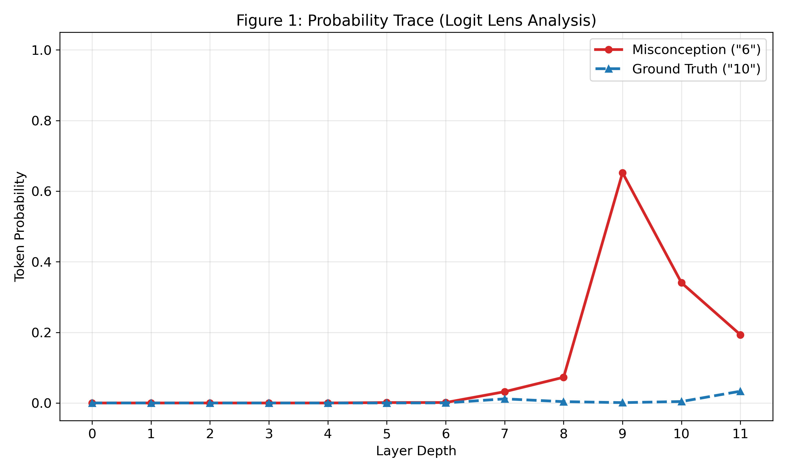

# Arithmetic Without Algorithms: Why does GPT-2 Small think "5 + 5 = 6"?

[](https://colab.research.google.com/github/beachcities/gpt2-arithmetic-mechanistic-analysis/blob/main/notebooks/experiment.ipynb)
[](https://opensource.org/licenses/MIT)
[](https://www.python.org/)
[]()

## Introduction
We often hear that LLM hallucinations come from an unknowable "black box."

In the **Large Language Model Course (Advanced)** at **The University of Tokyo**, which I have been attending since late last year, the approach is not to treat models as black boxes but to deeply investigate their behaviors. While catching up on my coursework during the year-end holidays, I encountered a fascinating anomaly during an exercise.

When I provided **GPT-2 Small** with the context `1+1=2, 2+2=4` and then asked `5+5=`, the model confidently answered: **"6"**

To a human, this is inexplicable. However, to understand the process behind this phenomenon, I chose to treat the model not as a black box, but as a transparent system using a **Mechanistic Interpretability** approach.
By directly observing the firing of internal circuits from **the model's input to output**, I discovered that **for the model's internal logic**, this was indeed the statistically "correct" answer.

## 🔍 Key Figures

| Causal Circuit Diagram | Probability Trace | Intervention Results |
|---|---|---|
|  |  |  |
| **Figure 10:** Visualizing the heuristic pathway and "Alien Logic" flow. | **Figure 1:** The moment the model commits to "6" (Layers 8-9). | **Figure 4:** Proving causality by switching off specific circuits. |

More figures are available in the [figures/](figures/) directory.

## Why GPT-2 Small?
GPT-2 Small is used as a *model organism* in mechanistic interpretability research because:
- Its architecture is small enough to inspect every component.
- Its circuits (induction heads, MLP features, SAE decompositions) are well-studied.
- It still exhibits rich, non-trivial behaviors such as arithmetic failures.

This makes it ideal for causal analysis of internal mechanisms.

## Key Findings: The Absence of Algorithms
Using **Sparse Autoencoders (SAE)** to scan the internal states, I found that the model was not performing arithmetic at all. Instead, two **heuristic circuits** were mechanically driving the output:

1.  **Induction Heads (Context Copying):**
    Specific attention heads fixated on the previous answer "4" and copied it from the context.
2.  **Sequence Completion Features:**
    An SAE feature fired intensely, predicting that "after a sequence of 4 and 5, 6 must follow."

The model did not "calculate" the number; it purely **completed the pattern** based on statistical likelihood.

## Conclusion
"5 + 5 = 6" is a structural failure caused by the inappropriate coupling of **context copying** and **sequence completion**.

In recent years, tools and approaches that enable such detailed analysis have become increasingly available. I believe that decoding the black box step-by-step and understanding *why* models fail is a crucial process for enhancing the reliability of LLMs as tools and ensuring their safe implementation in society.

## Repository Structure

* `notebooks/`: Contains the reproducible analysis notebook.
    * [**experiment.ipynb**](notebooks/experiment.ipynb): The main notebook for reproducing the "5+5=6" anomaly and performing the SAE analysis.
* `figures/`: Generated figures used in the reports.
* `reports/`: Detailed reports in English and Japanese.
    * [**English Report**](reports/report_en.md)
    * [**Japanese Report (日本語レポート)**](reports/report_ja.md)

## How to Reproduce
To reproduce the analysis in a local environment:

1. Clone this repository.
2. Install the requirements.

```bash
pip install -r requirements.txt
