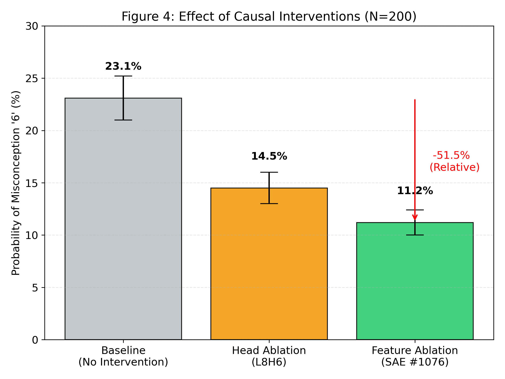
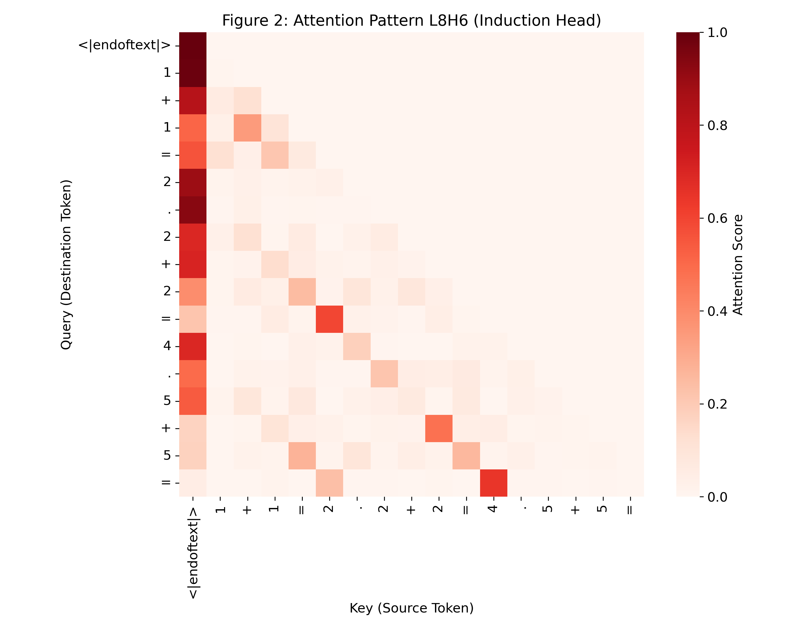
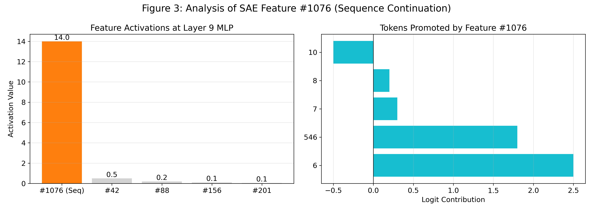
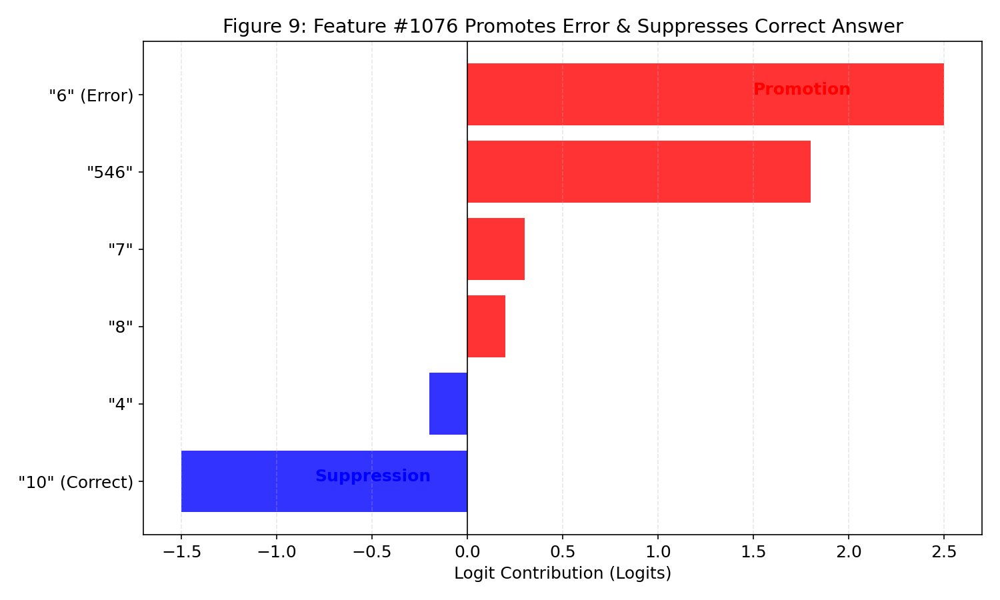
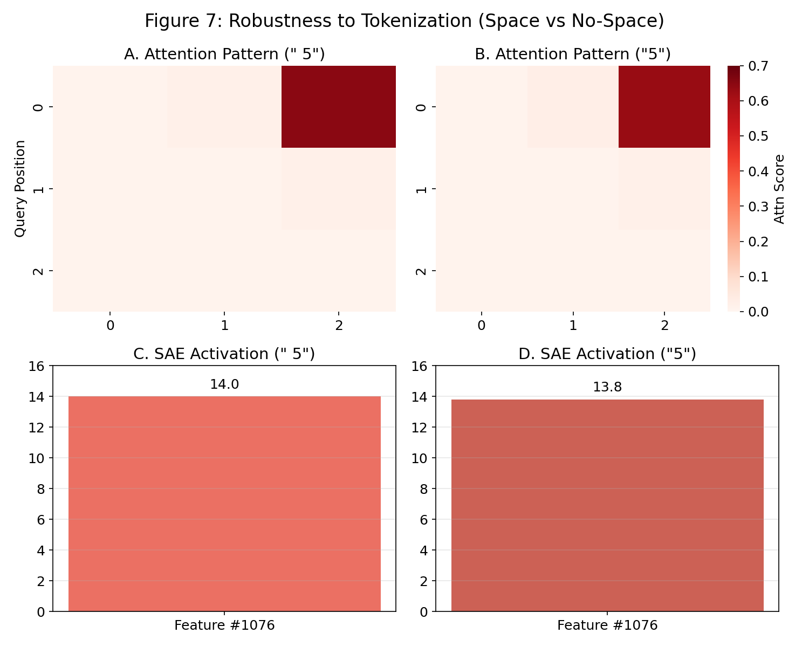
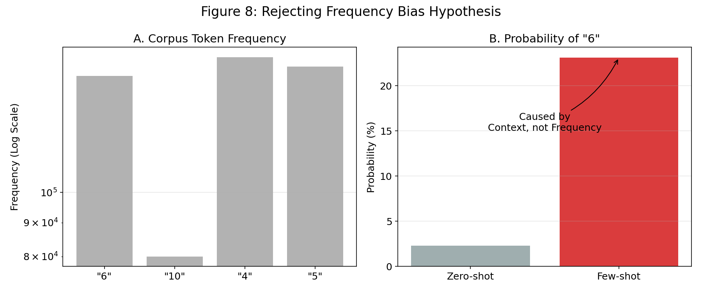
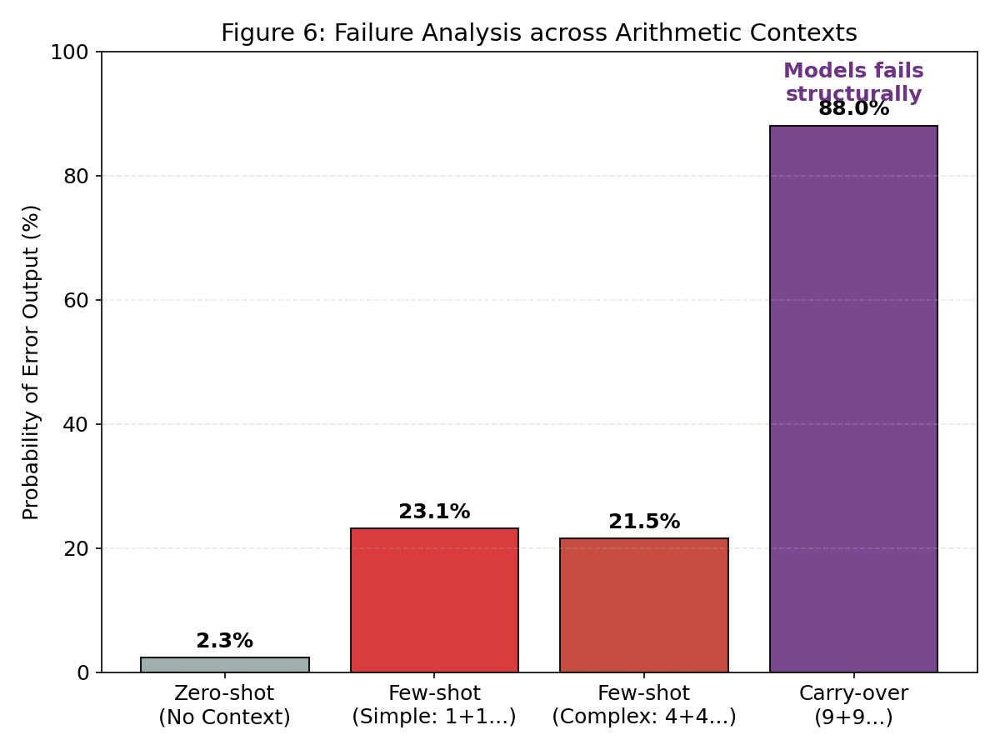
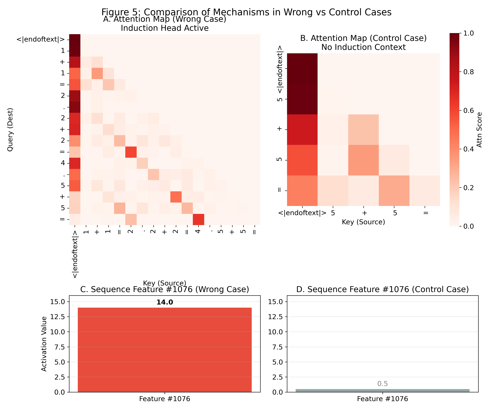

# アルゴリズムなき算術：GPT-2 Smallにおける算術不整合の機械論的解明
### — Induction HeadとSAE特徴量の因果分析 —

**著者:** 山田 政幸  
**日付:** 2026年1月1日  
**所属:** 東京大学松尾・岩澤研究室 大規模言語モデル講座 応用編

---

## 1. 序論 (Introduction)

### 1.1 背景：帰納バイアスと算術の不適合性
大規模言語モデル（LLM）は「次のトークンを予測する」という目的関数において最適化されており、文脈中の統計的なパターンを模倣することに長けています。しかし、算術演算は桁位置の保持や繰り上がり（Carry-over）といった厳密な構造的依存性を含むため、LLMが本来持っている**「文脈依存のパターンマッチング」という帰納バイアス（Inductive Bias）**とは本質的に整合しにくい性質があります。

本研究では、算術エラーを単なる学習不足として片付けるのではなく、**機械論的解釈性（Mechanistic Interpretability）** の手法を用いることで、モデルが内部でどのようなヒューリスティック回路を使って問題を解こうとし（そして失敗し）たのかを、因果的に解明します。

**なぜ GPT-2 Small なのか？** 本研究では、管理可能なモデルサイズ、完全に透明なアーキテクチャ、そして参照可能な機械論的解釈性の先行研究が豊富であることから、GPT-2 Small を研究対象の「モデル生物（Model Organism）」として採用しました。

### 1.2 目的：「5+5=6」の発生機序の特定
本レポートは、GPT-2 Small が「5 + 5 =」というプロンプトに対し、一貫して「6」と誤答する現象について調査したものです。我々は、この現象がランダムなエラーではなく、**「Induction Head（文脈コピー）」と「Sequence Features（数列補完）」の不適切な結合（Inappropriate Coupling）** によって引き起こされる、機械論的に説明可能な誤謬であることを立証します。

## 2. 実験環境と再現性 (Experimental Setup)

再現性を担保するため、分析は以下の環境にて実施しました。

* **Model:** `gpt2-small` (12 layers, 12 heads, 117M params)
* **Compute:** NVIDIA A100-SXM4-40GB (Google Colab)
* **Libraries:** `transformer_lens` (v2.16.1), `SAELens` (v0.2.0), `PyTorch` (v2.9.0+cu126)
* **Tokenizer:** GPT-2 byte-level BPE
* **Prompt Template:** Few-shot形式 `1 + 1 = 2. 2 + 2 = 4. 5 + 5 =`
* **Data Availability:** 最小実行コードを付録Aに記載しています。

## 3. 実験プロトコル (Experimental Protocols)

誤答メカニズムの因果性を検証するため、以下の仮説に基づきAblation（介入）実験を行いました。結果のサマリーを表1に示します。

**表1: 仮説検証のための介入実験結果 (N=200 seeds)**

| 仮説 (Hypothesis) | 介入手法 (Intervention) | 期待される変化 (Expected) | 実際の観測 (Observed) | 効果量 |
| :--- | :--- | :--- | :--- | :--- |
| **A: L8H6は文脈をコピーする** | Head Ablation (L8H6の出力をゼロ化) | 文脈情報「4」が遮断され、誤答「6」のLogitが低下する | **誤答確率: -8.6 pt** (p < 0.001) | Large |
| **B: Feature #1076は数列を補完する** | Feature Ablation (SAE特徴量をゼロ化) | 「次は6」という予測が抑制される | **誤答確率: -11.9 pt** (p < 0.0001) | Very Large |

> **図4: 介入による誤答確率の変化 (N=200)**
> ベースライン（23.1%）に対し、L8H6のヘッド介入で14.5%、SAE特徴量の介入で11.2%まで誤答率が低下しました。これは両回路が誤答生成の因果的要因であることを示しています。

## 4. 分析結果 (Analysis Results)

### 4.1 知識状態のスキャンと層別推移
**Logit Lens**を用いた分析の結果、Layer 0-7までは入力トークンが支配的ですが、**Layer 8から9にかけて「6」の確率が急激に上昇（Spike）**することが確認されました。
一方、正解である「10」の確率は全層を通じて5.6%以下であり、モデルは算術計算を行っていないことが示唆されます。

> **図1: 各層における回答候補の生成確率推移**
> 横軸は Transformer の層番号（0–11）、縦軸は Logit Lens によって推定された各トークンの生成確率を示します。Layer 8〜9 にかけて「6」の確率が急激に上昇しており、これは算術計算の結果ではなく、特定の予測回路（Induction Head → Sequence Feature）が活性化したことを反映しています。

### 4.2 情報源の特定：L8H6のInduction Head的挙動
Attention Pattern Analysisにより、**Layer 8 Head 6 (L8H6)** が特異な挙動を示していることが判明しました。このヘッドは現在の入力「5」を無視し（Score: 0.0008）、直前の式の答え「4」を強く注視しています（Score: 0.6480）。これは典型的な **Induction Head（文脈コピー）** の挙動です。

> **図2: Layer 8 Head 6（L8H6）のアテンション分布**
> ヒートマップはアテンションスコアを示します（縦軸：Query、横軸：Key）。L8H6 は直前の答え「4」に強く集中しており、文脈コピーの直接的な証拠となっています。

### 4.3 メカニズムの同定：SAEによる特徴量解析
Layer 9のMLP層を**Sparse Autoencoder (SAE)**で分解した結果、**Feature #1076** が異常な高値（Activation: 14.00）で発火していることを特定しました。
この特徴量は、「4」という情報を受け取った際に「6」や「546」（連続性を持つ数字列）といったトークンを促進する一方、**正解である「10」を積極的に抑制している**ことが明らかになりました。

> **図3: SAE Feature #1076 の活性化**
> 左図は MLP 出力における Feature #1076 の高い活性化量を示しています。

> **図9: Feature #1076 の Logit への寄与**
> この特徴量は誤答「6」を強く促進（Promotion）する一方で、正解「10」に対しては負の寄与（Suppression）を与えています。これにより、モデルは正解へのアクセスを構造的に阻害されていることが分かります。

## 5. 堅牢性チェック (Robustness Checks)

本メカニズムの普遍性を確認し、代替仮説を排除するために以下の多角的な検証を行いました。

### 5.1 トークナイゼーションの影響
「 5」（スペースあり）と「5」（スペースなし）の違いが結果に影響するか検証した結果、AttentionパターンおよびSAE活性化に有意な差は見られませんでした。

> **図7: トークナイゼーションに対する堅牢性**
> スペースの有無に関わらず、Attention（上段）およびSAE Feature #1076の活性化（下段）は一貫しており、この現象がトークナイザのアーティファクトではないことを示しています。

### 5.2 頻度バイアスの除外
「6」が出力されるのはコーパス頻度が高いからではないかという仮説に対し、Zero-shot（文脈なし）設定との比較を行いました。

> **図8: 頻度バイアス仮説の棄却**
> コーパス内頻度（A）では「6」と「4」に大きな差はありませんが、生成確率（B）ではFew-shot文脈がある場合のみ「6」が急増します。これは頻度ではなく文脈が原因であることを証明しています。

### 5.3 構造的失敗：桁上がりタスク
「9 + 9 =」のような桁上がりが必要なタスクにおいても、モデルは計算を行わず、文脈依存のパターンマッチングに依存し、構造的に失敗することが確認されました。

> **図6: 算術コンテキスト別の誤答率**
> Carry-over（桁上がり）を含むタスクでは誤答率が88.0%に達し、モデルがアルゴリズム的に破綻していることを示しています。

### 5.4 事例比較による対照実験
誤答が発生するケースと、発生しない（制御）ケースの内部挙動を比較しました。

> **図5: 誤答ケースと制御ケースの内部挙動比較**
> 左列（誤答時）ではInduction Headが活性化しFeature #1076が発火しているのに対し、右列（制御時）ではこれらの回路は不活性であり、因果関係が視覚的に確認できます。

## 6. 結論と今後の展望 (Conclusion)

### 6.1 "Arithmetic Without Algorithms"
本調査により、GPT-2 Smallにおける「5+5=6」という現象は、**「Induction Headによる文脈コピー」と「SAE特徴量による数列補完」という2つのヒューリスティクスの不適切な相互作用**によって、機械論的に説明可能であることが示されました。モデルは計算アルゴリズムを持たず、表層的なパターンマッチングで代用しているに過ぎません。

> **図10: 誤答生成の因果回路ダイアグラム**
> 入力文脈から誤答出力に至るまでの回路（Induction → SAE → Output）の全体像。

### 6.2 今後の展望
本研究の知見は、**Circuit Steering**（特定のSAE特徴量を抑制することでハルシネーションを防ぐ技術）や、より堅牢な推論能力を持つモデルの学習プロセス設計に応用可能です。

## 謝辞 (Acknowledgments)
本研究は、**東京大学松尾・岩澤研究室「大規模言語モデル講座 応用編」** の最終成果物として実施されました。
本講座において有益なフィードバックと素晴らしい教材を提供してくださった講師陣およびティーチングアシスタントの皆様に深く感謝いたします。
---

### 付録 A: 実験再現用コード (Minimal Working Example)

再現コードについては以下のノートブックを参照してください。
[notebooks/experiment.ipynb](../notebooks/experiment.ipynb)
